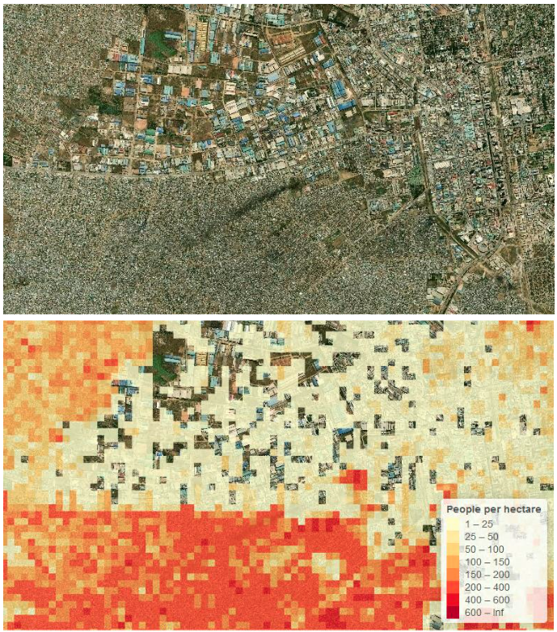
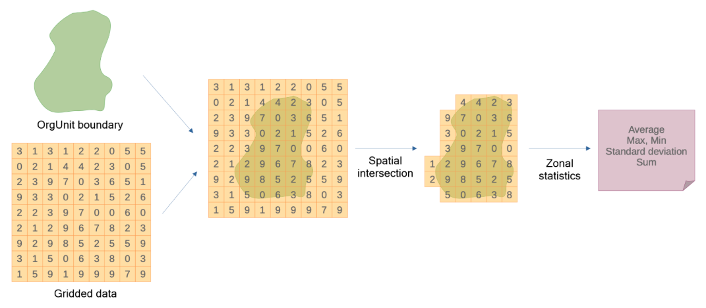

# WorldPop Global2 - Design and Installation Guide { #ggd-wp-general }

## Overview

### Purpose

Our metadata package defines a minimal aggregate data structure in DHIS2 to support automated import of population estimates derived from WorldPop datasets with the Import/Export app.
It includes metadata for storing population totals and population disaggregated by sex and age groups, enabling use of WorldPop Global2 population estimates in analytics and indicator calculations.

### Background

WorldPop Global2 (released 2025-2026) provides global annual population estimates for 2015-2030 at 100x100m resolution with disaggregations by age and sex. You can find below a close view of the dataset at city level and notice its gridded structure. For more detailed information you can consult the data provider’s page [here](https://www.worldpop.org/blog/worldpop-global2-global-high-resolution-population-estimates-for-2015-2030/). 

_Gridded population data. Adapted from WorldPop._

### Importing from a gridded dataset

WorldPop datasets are provided as a grid covering the whole world. To import the data in DHIS2 to Organisation Unit level we will use the Organisation Unit boundaries to extract only the grid cells that overlap and finally sum the value of these grid cells to obtain the population in the Organisation Unit that can now be imported in DHIS2 as a Data Value. The figure below summarises the process of extraction. 

_Gridded data extraction by polygon. Adapted from Saldanha et al._

### Requirements

To import Global2 population data via the Import/Export app:
* A **Google Earth Engine API** must be configured on your system (you can find instructions on how to set one up [here](https://docs.dhis2.org/en/topics/tutorials/google-earth-engine-sign-up.html#accessing-map-layers-from-google-earth-engine) if needed). Google Earth Engine is one of the repositories which store WorldPop data and they also provide the infrastructure to extract the population values for each Organisation Unit.
* The **Organisation Units boundaries** must be available via their geometries. Note that these geometries must be polygons for the process to work (for administrative areas see [here](https://docs.dhis2.org/en/use/user-guides/dhis-core-version-master/configuring-the-system/maps.html), and, if you want to go down to facility level, you can learn about catchment areas boundaries use and definition [here](https://docs.dhis2.org/en/implement/health/campaigns/dhis2-features-for-campaigns.html#creating-storing-catchment-areas) and [here](https://apps.dhis2.org/app/de19ff76-3459-4ec1-a881-5b8644cd6c51)).
* Finally, the **appropriate DHIS2 metadata** (Data Elements, Category Combinations, etc.) must be configured to receive the Data Values, which is the object of the current document.

## Metadata file

### Data Set and Data Element Group

Table 1

### Data Elements and dependencies

Table 2

WorldPop datasets are meant to be updated over time, new releases require a fresh import. To ensure traceability, consider creating separate data elements for each release and including the version (e.g., “Global2”) in the name or description.

Population figures may change slightly over time, and new releases require a fresh import. To track which data is used, consider creating separate data elements for each release and including the version in the name or description.

### User Groups

Table 3

## Running the import process

We recommend importing data separately for each organisation unit level, as possible inaccuracies or gaps in lower-level geometries would otherwise propagate when aggregating results to higher levels.
