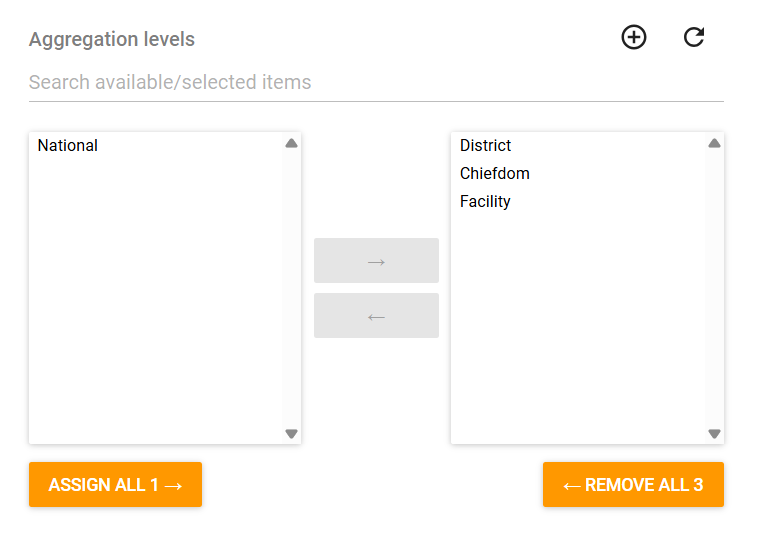
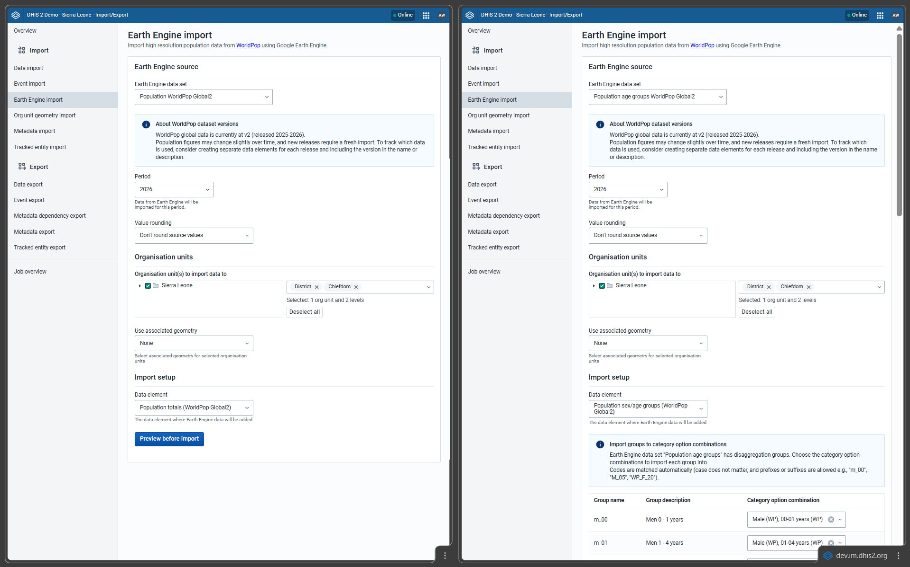

# WorldPop Global2 - Design and Installation Guide { #ggd-wp-general }

## Overview

### Purpose

This metadata package defines a minimal aggregate data structure in DHIS2 to support the automated import of population estimates derived from WorldPop datasets using the Import/Export app.

The package provides the required metadata to store total population counts as well as population disaggregated by sex and age groups. This enables the integration of WorldPop Global2 population estimates into DHIS2 analytics.

### Background

WorldPop Global2 (released 2025-2026) provides global annual population estimates for 2015-2030 at 100x100m resolution with disaggregations by age and sex. The dataset is distributed as gridded population data covering the entire world.

The figure below illustrates a detailed view of the dataset at city level, highlighting its gridded structure. Additional information about the dataset and methodology is available on the WorldPop website: [here](https://www.worldpop.org/blog/worldpop-global2-global-high-resolution-population-estimates-for-2015-2030/). 

_Gridded population data. Adapted from WorldPop._

### Importing from a gridded dataset

WorldPop datasets are provided as raster grids rather than administrative totals. To use these data in DHIS2, population values must be aggregated to Organisation Unit geometries.

The import process works as follows:

1. Organisation Unit polygon geometries are used to identify grid cells overlapping each administrative area.

2. Population values from all intersecting grid cells are extracted.

3. The extracted values are summed to produce a population total for each Organisation Unit.

4. The aggregated result is imported into DHIS2 as Data Values.

The extraction and aggregation process is performed through Google Earth Engine via the DHIS2 Import/Export app.

The figure below summarises this extraction workflow.

_Gridded data extraction by polygon. Adapted from Saldanha et al._

### Requirements

To import WorldPop Global2 population data using the Import/Export app, the following prerequisites must be met:
* A **Google Earth Engine API** must be configured and accessible from the DHIS2 instance. Google Earth Engine hosts WorldPop datasets and provides the infrastructure required to extract population values for each Organisation Unit. Instructions for setting up access are available [here](https://docs.dhis2.org/en/topics/tutorials/google-earth-engine-sign-up.html#accessing-map-layers-from-google-earth-engine).
* **Organisation Units geometries** must be available and defined as polygons. These geometries are required to aggregate gridded population data. Guidance for configuring administrative boundaries is available [here](https://docs.dhis2.org/en/use/user-guides/dhis-core-version-master/configuring-the-system/maps.html)
For facility-level imports, catchment area boundaries may be used instead. Additional information is available [here](https://docs.dhis2.org/en/implement/health/campaigns/dhis2-features-for-campaigns.html#creating-storing-catchment-areas) and [here](https://apps.dhis2.org/app/de19ff76-3459-4ec1-a881-5b8644cd6c51).
* The required **DHIS2 metadata package** (Data Elements, Category Combinations, Data Sets, and related configuration) must be installed prior to running the import process. The configuration of this metadata is described in the following sections of this document.

## Metadata file description and adaptations

WorldPop datasets are periodically updated and new releases require a new import of population values. To ensure traceability between different WorldPop releases, the version identifier "Global2" is included in the names of the Data Sets and Data Elements provided in this metadata package.

Implementers are strongly encouraged not to overwrite existing population metadata or data from previous WorldPop versions. Instead, each new release should be imported using metadata that clearly identifies the dataset version.

### Data Set and Data Element Group

The metadata package includes a dedicated Data Set and associated Data Element Group used to organise WorldPop Global2 population data.

| Name | Purpose | Periodicity |
|------|---------|-------------|
| Population (WorldPop Global2) | Stores WorldPop Global2 population totals and population disaggregated by sex and age groups | Annual |

### Data Elements and dependencies

The metadata package includes two Data Elements designed to store aggregated population values derived from WorldPop grids.

| Name | Purpose | Groups |
|------|---------|--------|
| Population totals (WorldPop Global2) | Stores total population counts | - |
| Population sex/age groups (WorldPop Global2) | Stores population disaggregated by sex and age groups | 0-1 yo, 1-5 yo, 5 yo groups from 5 to 90, 90+ yo for Female and Male |

#### Descriptions adaptation

To strengthen data traceability, it is recommended to record the date of import in the description field of Data Elements.

This practice helps distinguish multiple imports performed over time and supports auditability of population data sources.

#### Aggregation levels adaptation

To prevent possible inaccuracies or gaps in lower Oranisation Units level geometries propagating when aggregating results to higher levels, **we recommend importing data for each organisation unit level**.

For this to be properly accounted for you need to adapt the Data Elements Aggregation levels to you configuration.

**Example**

In the case of the Sierra Leone demo database the correct configuration is illustrated below:

This configuration ensures that:
* District (level 2), Chiefdom (level 3), and Facility (level 4) use only population values imported for their respective levels.
* National level (level 1) remains excluded because a national geometry is not available for direct import. In this case, national totals are calculated through aggregation from District level data.

**General rule**

* If a geometry exists → import population data at that level and include it in Aggregation Levels.
* If a geometry does not exist → allow aggregation from lower Organisation Units.

### User Groups

The metadata package defines two User Groups to support governance and controlled access to WorldPop data.

| Name | Purpose |
|------|---------|
| WP - Admin  | Performs metadata configuration, manages required adaptations, and runs WorldPop imports using the Import/Export app |
| WP - Access | Uses imported WorldPop data in analytics applications such as Dashboards, Data Visualizer, and Maps |

## Running the import process
 
Open the Import/Export app, select Earth Engine import.

1. Choose the data to import: Population totals or Population by sex and age groups

2. Choose the year to import (2015–2030), each year must be imported individually.

3. Choose the Organisation Units where population data will be imported.
    - Organisation Units must have polygon geometries
    - You may select the root Organisation Unit and include multiple levels
    - For large systems, test the process on a small sample first

4. Choose the Data Element: Population totals (WorldPop Global2) or Population sex/age groups (WorldPop Global2). If category options are correctly configured, sex and age groups will be matched automatically.

5. Preview the import.

6. Run the import.

After import, regenerate analytics tables before using the data in analytics apps.

Examples of import configurations are shown below:

